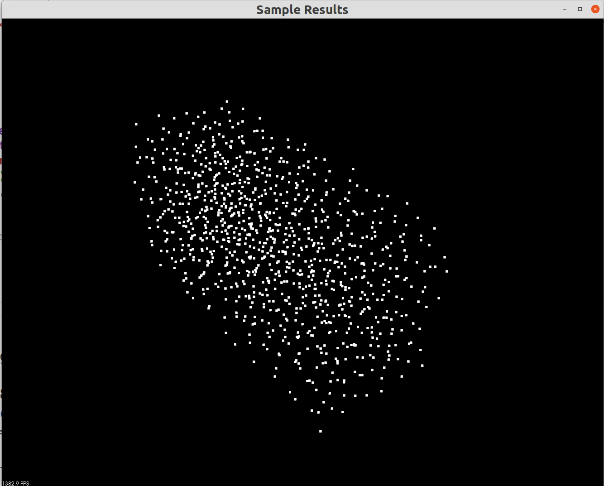
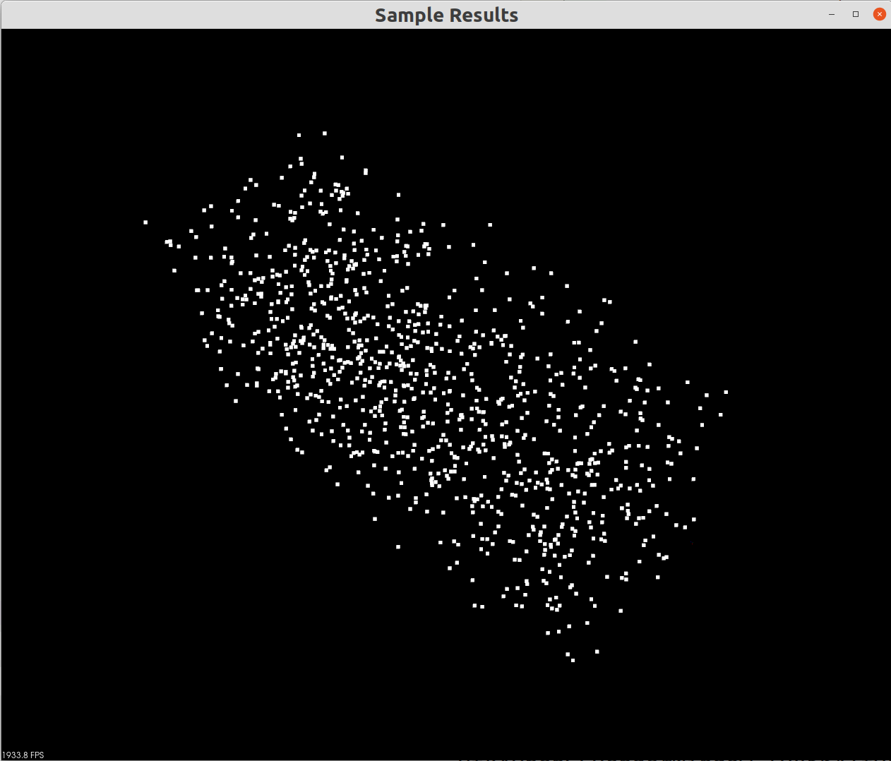

# 3D Poisson Disk Sampling Implementation

## Project Overview
This 3D Poisson disk sampling implementation extends the 2D work by [Martyn Afford](https://github.com/martynafford/poisson-disc-distribution-bridson), which is based on Robert Bridson's paper [_Fast Poisson Disk Sampling in Arbitrary Dimensions_](https://dl.acm.org/doi/10.1145/1278780.1278807).

The key modifications are made in the `point_around` function.

## Compilation Instructions
*Requires C++11.*


```bash
cd build
cmake ..
make -j8
```
To execute:
```bash
cd bin
./main
```

Executable outputs to `./bin`.

`yaml-cpp` and `PCL` are only used for examples, not required for core implementation.

## Features

- Header-only design with usage example in `main.cpp`
- Built-in comparison with uniform 3D sampling (`uniform_comparison` namespace)
- Visualization via PCL (`visualizePointCloud` function)
- YAML configuration to avoid hardcoded parameters
- Custom Shapes: Modify the `in_area` function to implement custom sampling regions
## Example Results
~1000 points in 80×100×200 box:

### Poisson Disk Sampling


### Uniform Sampling

